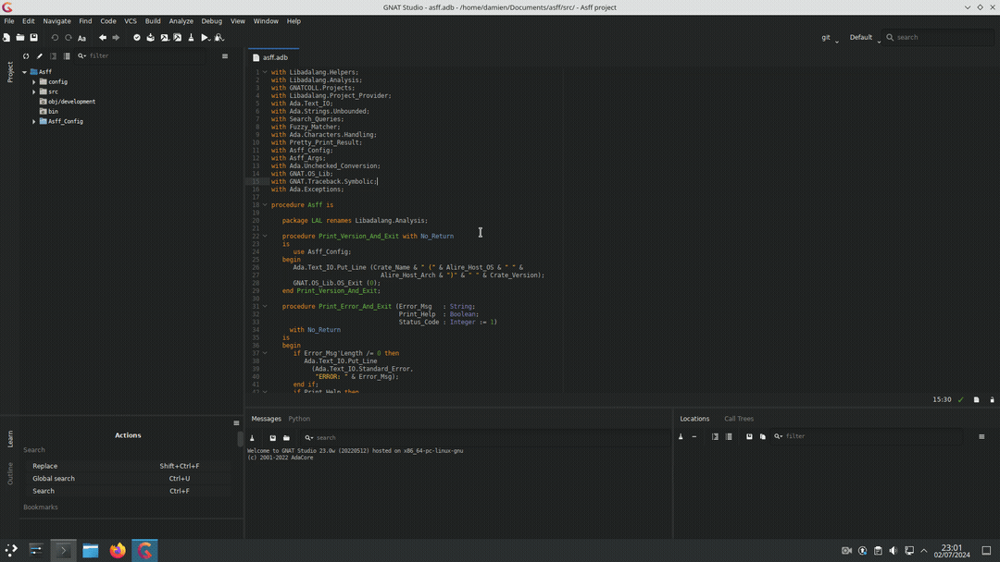

# asff - Ada Subprogram Fuzzy Finder

asff (Ada Subprogram Fuzzy Finder) is a tool designed to help finding Ada subprograms using their signatures.

## Table of Contents

- [Introduction](#introduction)
- [Features](#features)
- [Building from sources](#building-from-sources)
- [Installation](#installation)
- [Usage](#usage)
- [GNAT Studio Plugin](#gnat-studio-plugin)
- [License](#license)

## Introduction

Asff (Ada Subprogram Fuzzy Finder) is a command-line tool developed to help finding Ada subprograms based on their signatures.
By providing the arguments and returned types of a subprogram, asff helps Ada developers quickly identify and navigate to the relevant code within their projects.
Ada powerful type system encourages the use of highly specific types for distinct use cases.
This makes the language well-suited for signature fuzzy matching.

This project uses the Libadalang library for analyzing Ada code and the Alire ecosystem for managing dependencies and build environment.

## Features

- **Signature Matching**: asff uses fuzzy matching algorithms to match subprogram signatures.
- **Fast Navigation**: Quickly locate and navigate to the desired subprogram within your Ada codebase.
- **Command-Line Interface**: asff offers a simple and intuitive command-line interface.
- **Smart Query Processing**: asff smartly understands user queries, such as recognizing fully qualified type names.

## Building from sources

The easiest way to build asff is with the alire ecosystem:

```bash
alr build
```

## Installation

You can install asff using various methods, including rpm, deb, archive, or directly from the source code.
Unfortunately, Windows is not currently supported (if you're interested in contributing you're welcome 😀).

## Usage

### asff usage documentation

```bash
usage: asff [--help|-h] [--query|-q Query] [--limit-percentage LIMIT-PERCENTAGE]
            [--name-only] [--version] [--statistics STATISTICS] [--project|-P
           PROJECT] [--files|-f FILES [FILES...]] [--recursive|-U]

Asff: Ada subprogram fuzzy finder

positional arguments:

optional arguments:
   --help, -h          Show this help message
   --query, -q         Fuzzing query using the following syntax:
                       Function: (First_Type, Second_Type,...) -> Returned_Type
                       Procedure: (First_Type, Second_Type,...)
   --limit-percentage  Display matches with scores above the given percentage of
                        the top score. Default value is 10%
   --name-only         Print only subprogram name
   --version           Print version
   --statistics        Statistics file name
   --project, -P       Project file to use
   --files, -f         Files to analyze
   --recursive, -U     Process all units in the project tree, excluding
                       externally built projects
```

### Examples

In alire enviroment you need to use the `alr exec` command or source the environment yourself before running asff.
The following examples are from the alire project.

```bash
$ alr exec -- asff -P alire.gpr -q "(Crate) -> Name"
alire-crates.ads:38:4: function Name (This : Crate) return Crate_Name;
alire-crates.ads:49:4: function Base (This : Crate) return Releases.Release
     with Pre => not This.Externals.Is_Empty;
```

Sometimes using fully qualified type names give better resutls:

```bash
$ alr exec -- asff -P alire.gpr -q "(Crate) -> Dependencies.Dependency"
alire-toolchains.ads:25:4: function Any_Tool (Crate : Crate_Name) return Dependencies.Dependency;
alire-toolchains.ads:51:4: function Tool_Dependency (Crate : Crate_Name) return Dependencies.Dependency
     with Pre => Tool_Is_Configured (Crate);
```

For a better user experience with the command line interface, I advise you to source [asff_completion](completion/asff_completion)


## GNAT Studio Plugin

A plugin for the GNAT Studio IDE is available to integrate asff into your development workflow.
Currently, it lacks functionalities and customization features, but development is ongoing, and improvements are on the way.



### Plugin installation from sources

To install the plugin from sources you need to add the asff binary to the `PATH` and the [plugin](plugin/) folder to the `GNATSTUDIO_CUSTOM_PATH` variable environment.

## License

asff is licensed under the GNU GPLv3.0. See the LICENSE file for details.
